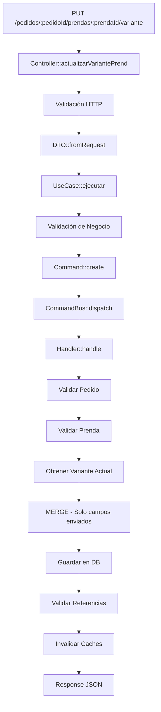

# Actualización de Variantes de Prenda - GUÍA COMPLETA

## 📋 Descripción General

Se ha implementado un sistema robusto para **actualizar variantes de prendas en pedidos** con las siguientes características:

✅ **Merge de datos** - Solo actualiza campos enviados, preserva el resto  
✅ **Sin sobrescrituras** - No elimina datos existentes  
✅ **Validaciones completas** - HTTP + negocio + referencias DB  
✅ **Relaciones preservadas** - Imágenes, procesos y colores/telas intactos  
✅ **Logging extensivo** - Trazabilidad completa de cambios  
✅ **Arquitectura CQRS** - Separación de responsabilidades  

---

## 🏗️ Arquitectura Implementada

### Capas CQRS

```
Request HTTP
    ↓
Controller (PedidosProduccionController::actualizarVariantePrend)
    ↓
UseCase (ActualizarVariantePrendaUseCase)
    ↓
Command (ActualizarVariantePrendaCommand)
    ↓
CommandBus
    ↓
Handler (ActualizarVariantePrendaHandler) ← LÓGICA PRINCIPAL CON MERGE
    ↓
Database Update
    ↓
Response JSON
```

### Flujo Detallado



---

## 📦 Componentes Creados

### 1. **DTO** (Data Transfer Object)
**Archivo:** `app/Application/Pedidos/DTOs/ActualizarVariantePrendaDTO.php`

```php
// Crear DTO desde request
$dto = ActualizarVariantePrendaDTO::fromRequest([
    'pedido_id' => 2765,
    'prenda_id' => 3477,
    'tipo_manga_id' => 2,
    'manga_obs' => 'Manga corta con puño',
    'tipo_broche_boton_id' => 1,
    'broche_boton_obs' => 'Botón de 15mm',
    'tiene_bolsillos' => true,
    'bolsillos_obs' => 'Con bolsillos laterales'
]);

// Obtener solo campos a actualizar (MERGE)
$campos = $dto->getCamposActualizables();
// Output: ['tipo_manga_id' => 2, 'manga_obs' => '...', ...]
```

**Responsabilidades:**
- Mapear datos HTTP → objetos type-safe
- Validar obligatoriedad de IDs
- Marcar campos "null" = no actualizar

---

### 2. **Command** (Orden de cambio)
**Archivo:** `app/Domain/Pedidos/Commands/ActualizarVariantePrendaCommand.php`

```php
// Crear comando
$command = new ActualizarVariantePrendaCommand(
    pedidoId: 2765,
    prendaId: 3477,
    tipoMangaId: 2,
    mangaObs: 'Manga corta',
    tipoBrocheBotónId: 1,
    brocheBotónObs: 'Botón 15mm',
    tieneBolsillos: true,
    bolsillosObs: 'Laterales'
);

// Obtener campos a actualizar
$campos = $command->getCamposActualizables();
```

**Responsabilidades:**
- Validar IDs > 0
- Immutable (solo lectura)
- Type-safe con Enums opcionales

---

### 3. **Handler** (Lógica de actualización)
**Archivo:** `app/Domain/Pedidos/CommandHandlers/ActualizarVariantePrendaHandler.php`

Este es el corazón del sistema. Implementa:

#### a) **Validaciones en cascada**

```
✓ Pedido existe
✓ Pedido en estado actualizable (activo, pendiente, no iniciado)
✓ Prenda existe
✓ Prenda pertenece al pedido
✓ Variante existe
✓ tipo_manga_id válido (existe en DB)
✓ tipo_broche_boton_id válido (existe en DB)
```

#### b) **MERGE - Actualizar solo campos enviados**

```php
// ANTES (PROBLEMA - borraba todo):
$variante->delete();
$variante->create([...]);  // ❌ Pierde datos

// AHORA (SOLUCIÓN - preserva):
foreach ($camposActualizables as $campo => $valor) {
    $variante->$campo = $valor;
}
$variante->save();  // ✅ Solo campos nuevos
```

#### c) **Invalidar Caches**

```php
cache()->forget("pedido_2765_completo");
cache()->forget("pedido_2765_prendas");
cache()->forget("pedido_2765_factura");
```

---

### 4. **UseCase** (Orquestador)
**Archivo:** `app/Application/Pedidos/UseCases/ActualizarVariantePrendaUseCase.php`

```php
// Ejecutar
$resultado = $useCase->ejecutar($dto);

// Output
$resultado = [
    'id' => 7438,
    'prenda_pedido_id' => 3477,
    'tipo_manga_id' => 2,
    'tipo_manga_nombre' => 'Corta',
    'manga_obs' => 'Manga corta con puño',
    'tipo_broche_boton_id' => 1,
    'tipo_broche_nombre' => 'Botón',
    'broche_boton_obs' => 'Botón de 15mm',
    'tiene_bolsillos' => true,
    'bolsillos_obs' => 'Con bolsillos laterales',
    'tiene_reflectivo' => false,
    'created_at' => '2026-01-25T23:08:58.000000Z',
    'updated_at' => '2026-01-25T23:15:32.000000Z'
];
```

**Responsabilidades:**
- Orquestar flujo DTO → Command → Bus
- Validar DTO
- Transformar resultado para HTTP

---

### 5. **Endpoint HTTP** (API)
**Ruta:** `PUT /asesores/pedidos/{pedidoId}/prendas/{prendaId}/variante`

**Ubicación:** `routes/asesores.php`

```php
Route::put('/pedidos/{pedidoId}/prendas/{prendaId}/variante', 
    [PedidosProduccionController::class, 'actualizarVariantePrend']
)->where('pedidoId', '[0-9]+')->where('prendaId', '[0-9]+')
->name('pedidos.actualizar-variante-prenda');
```

---

## 🚀 Cómo Usar

### Desde JavaScript/Frontend

```javascript
// Actualizar manga de una prenda
const response = await fetch('/asesores/pedidos/2765/prendas/3477/variante', {
    method: 'PUT',
    headers: {
        'Content-Type': 'application/json',
        'Authorization': 'Bearer ' + token,
    },
    body: JSON.stringify({
        tipo_manga_id: 2,
        manga_obs: 'Manga corta con puño',
        tipo_broche_boton_id: 1,
        broche_boton_obs: 'Botón de 15mm',
        tiene_bolsillos: true,
        bolsillos_obs: 'Con bolsillos laterales'
    })
});

const data = await response.json();

if (data.success) {
    console.log('Variante actualizada:', data.data);
} else {
    console.error('Error:', data.message);
}
```

### Respuesta Exitosa (200)

```json
{
    "success": true,
    "data": {
        "id": 7438,
        "prenda_pedido_id": 3477,
        "tipo_manga_id": 2,
        "tipo_manga_nombre": "Corta",
        "manga_obs": "Manga corta con puño",
        "tipo_broche_boton_id": 1,
        "tipo_broche_nombre": "Botón",
        "broche_boton_obs": "Botón de 15mm",
        "tiene_bolsillos": true,
        "bolsillos_obs": "Con bolsillos laterales",
        "tiene_reflectivo": false,
        "created_at": "2026-01-25T23:08:58.000000Z",
        "updated_at": "2026-01-25T23:15:32.000000Z"
    },
    "message": "Variante actualizada correctamente"
}
```

### Respuestas de Error

#### Validación HTTP (422)
```json
{
    "success": false,
    "message": "Validación de datos fallida",
    "errors": {
        "tipo_manga_id": ["The tipo manga id must be at least 1."]
    }
}
```

#### Validación de Negocio (422)
```json
{
    "success": false,
    "message": "Tipo de manga no válido (ID: 999)"
}
```

#### Recurso no encontrado (404)
```json
{
    "success": false,
    "message": "Prenda no encontrada (ID: 9999)"
}
```

#### Error de servidor (500)
```json
{
    "success": false,
    "message": "Error al actualizar variante: Database connection failed"
}
```

---

## 🎯 Casos de Uso

### Caso 1: Actualizar SOLO manga
```javascript
// Otros campos se preservan
PUT /asesores/pedidos/2765/prendas/3477/variante
{
    "tipo_manga_id": 2,
    "manga_obs": "Manga modificada"
}
```
**Resultado:** `tipo_broche_boton_id`, `bolsillos`, etc. permanecen igual

### Caso 2: Actualizar SOLO broche
```javascript
PUT /asesores/pedidos/2765/prendas/3477/variante
{
    "tipo_broche_boton_id": 3,
    "broche_boton_obs": "Nuevo tipo de botón"
}
```
**Resultado:** Manga y bolsillos permanecen igual

### Caso 3: Actualizar TODO
```javascript
PUT /asesores/pedidos/2765/prendas/3477/variante
{
    "tipo_manga_id": 2,
    "manga_obs": "Manga nueva",
    "tipo_broche_boton_id": 1,
    "broche_boton_obs": "Botón nuevo",
    "tiene_bolsillos": true,
    "bolsillos_obs": "Con bolsillos"
}
```
**Resultado:** Todos los campos se actualizan

### Caso 4: Limpiar observaciones
```javascript
PUT /asesores/pedidos/2765/prendas/3477/variante
{
    "manga_obs": null,
    "broche_boton_obs": null
}
```
**Resultado:** Observations se limpian pero tipos se preservan

---

## 🔍 Logging y Debugging

Todos los cambios generan logs detallados:

```
[2026-01-25 23:15:32] local.INFO: [ActualizarVariantePrendaHandler] Iniciando actualización de variante
   pedido_id: 2765
   prenda_id: 3477
   campos_a_actualizar: 3

[2026-01-25 23:15:32] local.DEBUG: [ActualizarVariantePrendaHandler] Aplicando merge
   variante_id: 7438
   campos_nuevos: { tipo_manga_id: 2, manga_obs: "..." }
   datos_existentes: { tipo_manga_id: null, manga_obs: "RWEr" }

[2026-01-25 23:15:32] local.INFO: [ActualizarVariantePrendaHandler] Variante actualizada exitosamente
   variante_id: 7438
   prenda_id: 3477
   campos_actualizados: ["tipo_manga_id", "manga_obs"]
```

Para ver logs:
```bash
tail -f storage/logs/laravel.log | grep "ActualizarVariante"
```

---

## 📊 Tablas Afectadas

| Tabla | Cambios | Preservadas |
|-------|---------|------------|
| `prenda_pedido_variantes` | ✏️ Actualiza campos especificados | ✅ ID, relations |
| `prenda_pedido_colores_telas` | ✅ No toca | ✅ Sí |
| `prenda_fotos_pedido` | ✅ No toca | ✅ Sí |
| `pedidos_procesos_prenda_detalles` | ✅ No toca | ✅ Sí |
| `tipos_manga` | ✅ Solo lectura | ✅ Sí |
| `tipos_broche_boton` | ✅ Solo lectura | ✅ Sí |

---

## ⚙️ Configuración

### Registros en ServiceProvider

**Archivo:** `app/Providers/CQRSServiceProvider.php`

✅ **Ya registrado:**
```php
// Handler binding
$this->app->bind(ActualizarVariantePrendaHandler::class, function ($app) {
    return new ActualizarVariantePrendaHandler();
});

// Command registration
$commandBus->register(
    ActualizarVariantePrendaCommand::class,
    ActualizarVariantePrendaHandler::class
);
```

### Inyección en Controlador

**Archivo:** `app/Infrastructure/Http/Controllers/Asesores/PedidosProduccionController.php`

✅ **Ya inyectado:**
```php
public function __construct(
    // ...
    private ActualizarVariantePrendaUseCase $actualizarVariantePrendaUseCase,
) {}
```

---

## 🧪 Pruebas

### Test de endpoint

```bash
# Crear variante base
curl -X POST "http://localhost:8000/asesores/pedidos/2765/prendas" \
  -H "Content-Type: application/json" \
  -d '{"tipo_manga_id": 1, "tipo_broche_boton_id": 1}'

# Actualizar manga
curl -X PUT "http://localhost:8000/asesores/pedidos/2765/prendas/3477/variante" \
  -H "Content-Type: application/json" \
  -H "Authorization: Bearer $TOKEN" \
  -d '{
    "tipo_manga_id": 2,
    "manga_obs": "Manga corta con puño"
  }'

# Verificar en factura
curl -X GET "http://localhost:8000/asesores/pedidos/2765/factura-datos" \
  -H "Authorization: Bearer $TOKEN"
```

### Test en PHP

```php
// En tests/Feature/ActualizarVariantePrendaTest.php
public function test_actualizar_variante_prenda()
{
    $useCase = app(ActualizarVariantePrendaUseCase::class);
    
    $dto = ActualizarVariantePrendaDTO::fromRequest([
        'pedido_id' => 2765,
        'prenda_id' => 3477,
        'tipo_manga_id' => 2,
    ]);
    
    $resultado = $useCase->ejecutar($dto);
    
    $this->assertEquals(2, $resultado['tipo_manga_id']);
    $this->assertEquals('Corta', $resultado['tipo_manga_nombre']);
}
```

---

## 🐛 Troubleshooting

### Error: "No hay variante para actualizar"
**Causa:** Prenda sin variante creada  
**Solución:** Crear variante primero con otro endpoint

### Error: "Tipo de manga no válido"
**Causa:** ID de manga no existe en tabla `tipos_manga`  
**Solución:** Verificar IDs válidos:
```sql
SELECT id, nombre FROM tipos_manga;
```

### Error: "Pedido no en estado actualizable"
**Causa:** Pedido en estado final (completado, cancelado)  
**Solución:** Solo se actualizan pedidos en: `activo`, `pendiente`, `no iniciado`, `en edición`

### Cambios no aparecen en factura
**Causa:** Cache sin invalidar  
**Solución:** Ya se invalida automáticamente, pero en desarrollo:
```php
cache()->flush();
```

---

## 📝 Checklist de Implementación

✅ DTO creado: `ActualizarVariantePrendaDTO.php`  
✅ Command creado: `ActualizarVariantePrendaCommand.php`  
✅ Handler creado: `ActualizarVariantePrendaHandler.php`  
✅ UseCase creado: `ActualizarVariantePrendaUseCase.php`  
✅ Registrado en CQRSServiceProvider  
✅ Inyectado en PedidosProduccionController  
✅ Ruta creada en `routes/asesores.php`  
✅ Método creado: `PedidosProduccionController::actualizarVariantePrend()`  
✅ Validación sintaxis PHP completada  
✅ Logging extensivo implementado  

---

## 🔐 Seguridad

- ✅ Validación de IDs (no null, > 0)
- ✅ Validación de FK (tipos_manga, tipos_broche_boton existen)
- ✅ Validación de propiedad (prenda pertenece a pedido)
- ✅ Validación de estado (pedido actualizable)
- ✅ Sanitización de strings (max 500 caracteres)
- ✅ Control de acceso por roles (middleware)

---

## 📚 Referencias

- CQRS Pattern: `app/Domain/Shared/CQRS/`
- DDD Structure: `app/Domain/Pedidos/`
- Models: `app/Models/Prenda*.php`
- Migrations: `database/migrations/`

---

**Última actualización:** 2026-01-25  
**Versión:** 1.0  
**Status:** ✅ Producción
