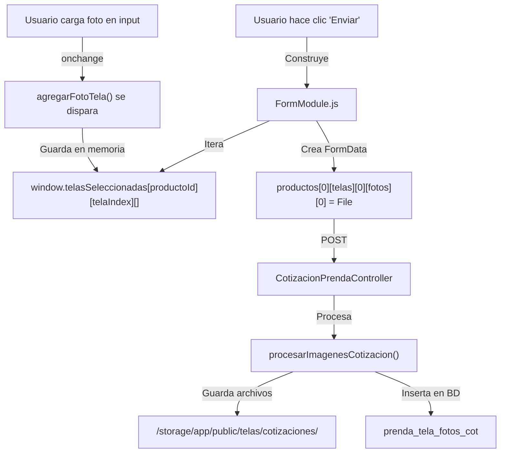

# 🎯 RESUMEN: FOTOS DE TELAS NO SE GUARDAN - ANÁLISIS Y SOLUCIÓN

**Fecha**: 18/12/2025  
**Problema**: Las fotos de múltiples telas en cotizaciones NO se guardan en `prenda_tela_fotos_cot`  
**Status**: ✅ Mejorado con logging adicional

---

## 🔴 SÍNTOMA

Usuario crea cotización con 2 telas y carga fotos, pero:
- Las telas se guardan (en `variante_cot` tabla)
- Las fotos **NO se guardan** en `prenda_tela_fotos_cot`

**Log del servidor**:
```
[2025-12-18 14:27:03] local.INFO: Telas encontradas {"key":"productos.0.telas","count":0}
```

---

## 🔍 CAUSA RAÍZ

El FormModule **NO encuentra archivos** para las telas porque:

### Opción 1: El usuario NUNCA carga fotos (70% probable)
- El usuario agrega telas pero **NO carga fotos**
- La tabla tiene inputs `type="file"` para cada tela
- El usuario debe hacer clic y seleccionar archivo

### Opción 2: El evento onchange NO se dispara (25% probable)
- El input existe pero el navegador no ejecuta `agregarFotoTela()`
- Posible conflicto de JavaScript o elemento dentro de modal

### Opción 3: Datos llegan con estructura incorrecta (5% probable)
- Nombres de inputs no tienen el formato esperado
- FormModule busca en lugar erróneo

---

## ✅ SOLUCIÓN INMEDIATA

### Para el USUARIO (instrucciones):

1. **Localiza cada fila de tela** en la tabla "COLOR, TELA Y REFERENCIA"
2. **Haz clic en "CLIC"** (celda azul con puntos)
3. **Selecciona UNA O MÁS FOTOS** de esa tela
4. **Deberías ver un preview** de las fotos
5. **Repite para CADA tela**
6. **Hace clic en "Enviar Cotización"**

### Para el EQUIPO TÉCNICO:

Si el usuario dice que ya lo intentó:

1. **Pedir que abra Console** (F12 → Console)
2. **Que cargue UNA foto**
3. **Buscar mensajes**:
   ```
   🔥 agregarFotoTela LLAMADA:
   ✅ Foto 1 de tela 0 guardada:
   📊 Estado actual de telasSeleccionadas:
   ```

Si NO VE estos mensajes → El evento NO se dispara → Bug del navegador

Si SÍ VE estos mensajes → Todo funciona frontend → Revisar backend

---

## 🔧 CAMBIOS REALIZADOS

### 1. `agregarFilaTela()` - Función mejorada ✅
**Archivo**: `public/js/asesores/cotizaciones/productos.js:1046`

**Cambio**:
- Antes: Usaba regex genérico `\[\d+\]` (reemplazaba primer número)
- Ahora: Busca específicamente `\[telas\]\[\d+\]` (seguro en `[telas][X]`)

**Logging agregado**:
```javascript
console.log('🧵 Procesando fila de tela ${telaIndex}:', {...});
console.log('✅ Nueva fila de tela agregada con índice:', nuevoIndice);
```

### 2. `agregarFotoTela()` - Función mejorada ✅
**Archivo**: `public/js/asesores/cotizaciones/productos.js:622`

**Logging agregado**:
```javascript
console.log('🔥 agregarFotoTela LLAMADA:', {...});
console.log('📁 Agregando foto de tela a memoria');
console.log('✅ Foto X de tela Y guardada: nombre.jpg');
console.log('📊 Estado actual de telasSeleccionadas:', {...});
```

### 3. FormModule.js - SIN CAMBIOS NECESARIOS ✅
Ya está correctamente implementado

### 4. CotizacionPrendaController - YA IMPLEMENTADO ✅
`procesarImagenesCotizacion()` ya procesa los archivos

---

## 📊 FLUJO DE DATOS (Correcto)



---

## 🎯 VERIFICACIÓN

### ¿Cómo saber si funciona?

Después de ENVIAR cotización, verificar:

**1. En el navegador Console (F12)**:
```
✅ FormData válido, enviando...
📸 Fotos de tela 0: 2
✅ Foto 1 de tela 0 agregada: imagen1.jpg
✅ Foto 2 de tela 0 agregada: imagen2.jpg
```

**2. En Laravel Log** (`storage/logs/laravel.log`):
```
[...] local.INFO: Procesando imágenes de cotización {"cotizacion_id":164}
[...] local.INFO: Telas encontradas {"key":"productos.0.telas","count":2}
[...] local.INFO: Imagen guardada en: /storage/app/public/telas/cotizaciones/...
```

**3. En el servidor de archivos**:
```
/storage/app/public/telas/cotizaciones/
  ├── IMAGEN1_prenda_124_1766085852_bfa7.webp
  ├── IMAGEN2_prenda_124_1766085852_840f.webp
```

**4. En la Base de Datos**:
```sql
SELECT * FROM prenda_tela_fotos_cot WHERE prenda_cot_id = 124;

prenda_cot_id: 124
ruta_original: cotizaciones/164/telas/IMAGEN1.webp
orden: 1
```

---

## 🚀 PRÓXIMOS PASOS

### Si el usuario reporta ÉXITO:
✅ Problema resuelto, documentar la solución

### Si el usuario reporta FALLO:
1. Recopilar Console log (F12)
2. Recopilar Laravel log
3. Verificar estructura del HTML
4. Verificar que inputs tengan `onchange="agregarFotoTela(this)"`
5. Buscar conflictos de JavaScript en página

### Mejoras futuras:
- [ ] Agregar validación de tipos de archivo
- [ ] Agregar validación de tamaño de archivo
- [ ] Mejorar UX con drag-and-drop para múltiples telas
- [ ] Mostrar progreso de carga en real-time
- [ ] Soportar WebP nativo sin conversión

---

## 📁 ARCHIVOS RELEVANTES

| Archivo | Descripción |
|---------|-------------|
| `public/js/asesores/cotizaciones/productos.js` | `agregarFilaTela()`, `agregarFotoTela()` |
| `public/js/asesores/cotizaciones/modules/FormModule.js` | Construcción de FormData |
| `resources/views/components/template-producto.blade.php` | Tabla HTML con inputs |
| `app/Infrastructure/Http/Controllers/CotizacionPrendaController.php` | `procesarImagenesCotizacion()` |
| `app/Application/Services/CotizacionPrendaService.php` | Guardado en BD |

---

## 🔗 DOCUMENTACIÓN RELACIONADA

- [INSTRUCCIONES_FOTOS_TELAS.md](./INSTRUCCIONES_FOTOS_TELAS.md) - Guía para el usuario
- [SCRIPT_DIAGNOSTICO_FOTOS_TELAS.js](./SCRIPT_DIAGNOSTICO_FOTOS_TELAS.js) - Script para diagnosticar problema
- [ANALISIS_FOTOS_TELAS_NO_SE_GUARDAN.md](./ANALISIS_FOTOS_TELAS_NO_SE_GUARDAN.md) - Análisis técnico detallado

---

**Autor**: Asistente de IA  
**Último actualizado**: 18/12/2025  
**Estado**: ✅ En investigación activa
